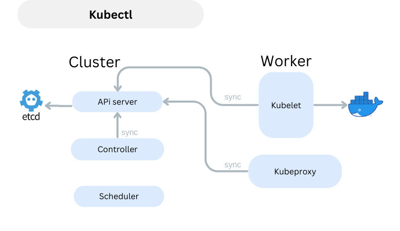
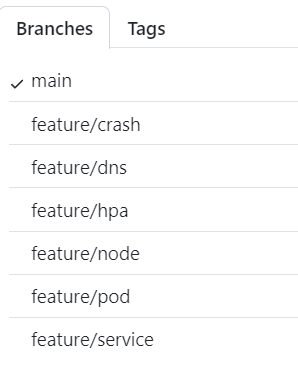
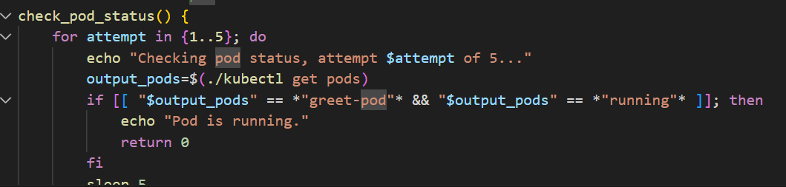
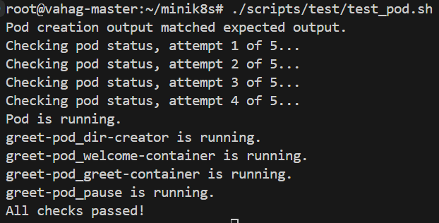
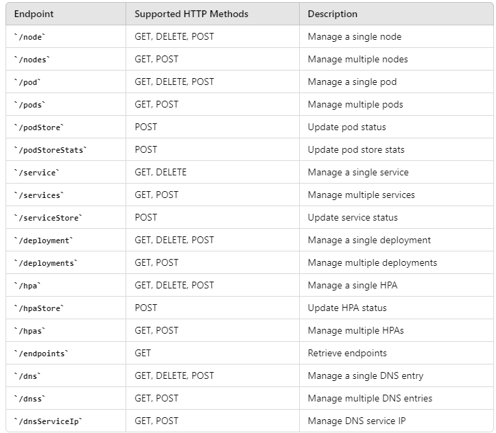
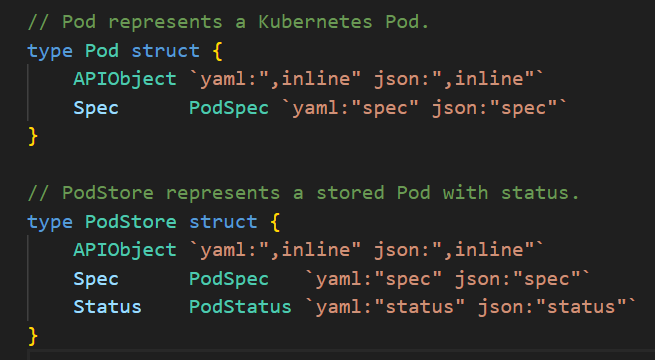
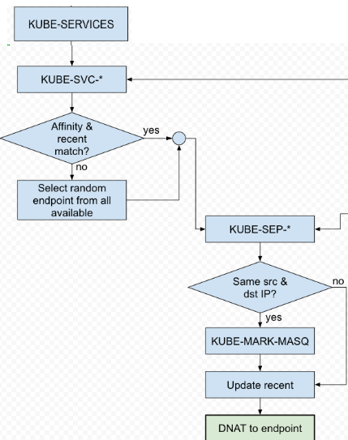
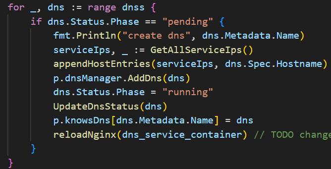
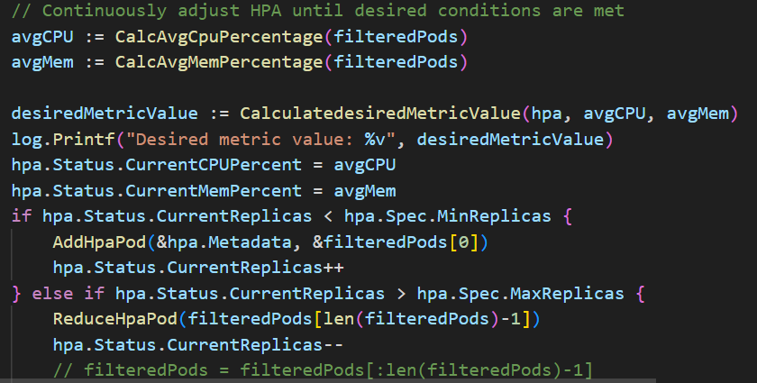

# Minik8s
 
 >  This project is implemented during "SE3356 Cloud Operating System Design and Practice" course, a simple [Kubernetes](https://kubernetes.io/) container orchestration tool, implemented in go language.


Codebase:
- Github: https://github.com/ghazariann/minik8s/tree/main


CI/CD is implemented on gihub.

## Project Management and Development

### Open source libraries used

- [github.com/docker/docker](https://github.com/moby/moby) Operations of the underlying container runtime
- [https://pkg.go.dev/net/http](https://pkg.go.dev/net/http) API Server framework
- [go.etcd.io/etcd/client/v3](https://github.com/etcd-io/etcd) Client for interacting with Etcd storage
- [github.com/spf13/cobra](https://github.com/spf13/cobra) Kubectl command line tool
- [github.com/coreos/go-iptables/iptables](https://github.com/coreos/go-iptables/) Operations of iptables for service
- [gopkg.in/yaml.v3](https://gopkg.in/yaml.v3) Go's yaml file parsing
- [gotest.tools/v3](https://github.com/gotestyourself/gotest.tools) Project testing framework
- [docker/login-action](https://github.com/docker/login-action) CICD automatically pushes images to dockerHub
- [docker/setup-qemu-action ](https://github.com/docker/setup-qemu-action) CICD cross-compilation platform
- [github.com/google/uuid](https://github.com/google/uuid) API object UUID generatio

### Architecture

**Development language**: Golang.

**Project Architecture**: The overall structure is mainly composed of two parts: control plane (master) and worker nodes. The components running on the control plane are mainly the following:

- API Server: Provides a series of RESTful interfaces, such as API object addition, deletion, modification and query interfaces
- Controller: Including DNS Controller, HPA Controller, Deployment Controller, mainly for maintenance of status.
- Scheduler: Responsible for returning the appropriate node from all available nodes according to a certain scheduling strategy

The following components run on WorkerNode

- kubeproxy: responsible for modifying DNS and Iptable, maintaining the status of Service
- Kubelet: maintaining the underlying creation of Pod, managing the Pod lifecycle, restarting/rebuilding Pod abnormalities.

 


### Project Management

**Project branches**：Development is carried out in multiple branches. Each functional point corresponds to a Feature branch wich later is tested and merged with main.




**Testing**
We have implemented test_*.sh files to test each components creation and deletion. You can find all tests in `./scripts/test` and run `./scripts/test/test_x.sh` for one test and `./scripts/test/test_all.sh` for all.


Simple test file looks like this.




And here is results



**CI/CD**：[TODO] 

We added our own Runner through Git Action and wrote a test script for the project to implement CI/CD. Ensure that the environment is fully initialized before each run.

1. All  code pushes will be sent to our own server, run unit tests, and directly displayed behind the results of a single push
2. When a Pr is initiated, the unit test will be automatically run again, and it can be merged only after the test passes
3. After the unit test passes, the executa file is build and published to the bin directory of the machine
4. After the above 2 and 3 are passed, for the case of merging into Master, docker-related images will be built and pushed to dockerhub.

## Components

### API Server

**API-Server**：API Server is responsible for interacting with etcd storage and providing some core APIObject APIs for other components to use. It provides create delete update and get methods for all Apiobject to be called from kubectl or worker node. Here are all the endpoints



**API-Object**
Minik8s has total of 7 Api objects: pod, service, deployment, node, endpoint, dns and hpa. Inspired by original k8s implementation each object has APIObject, Spec. In etcd we store modified api objects with Status info added: podStore, ServiceStore, etc. For instnace Pod keeps ApiObect and Spec, while PodStore keeps ApiObject, Spec and Status. 



### Kubelet

**Kubelet**：Kubelet ensures that each Pod can run normally on the node.

- Kubelet package consist of dockerClient, runtime and kubelet object.
- `dockerClient` is abstraction over go's docker sdk with helper function. 
- `runtime` interacts with the underlying Docker to create pods and containers, obtain the status of container operation, manage images and other operations.
- `kubelet` uses `runtime` to sync the container state with 

When a pod is created using the command kubectl create pod -f testdata/pod.yaml, the podHandler stores the PodStore object in etcd. Every 10 seconds, Kubelet checks for existing pods, compares them with previously stored data, and initializes any new pods using the runtime. If successful, it updates the pod status to 'running'. Additionally, Kubelet periodically checks the state of each container. If a container crash is detected, it will automatically recreate the container. A simple backup mechanism stores knownPods and knownContainers as JSON files on the host machine to safeguard against crashes. Each time Kubelet starts, it reads from these JSON files to recover the state of pods and containers.

### Controllers

The control plane includes several key controllers, each responsible for specific aspects of cluster management:

- Deployment (ReplicaSet) Controller: Ensures the actual number of pods matches the desired count defined in deployments. It adjusts the number of pods by creating new ones if there are too few, or terminating extra ones if there are too many.

- HPA (Horizontal Pod Autoscaler) Controller: Monitors resource usage like CPU and memory against targets specified in HPAs. It adjusts the number of pod replicas to meet the demand, scaling up or down as necessary.

- DNS Controller: Manages DNS entries for services, updating configurations across the cluster in response to changes to DNS resources.

### Kubectl

Kubectl is a command line interactive tool for minik8s. Most of the commands are insipred by k8s. We used Cobra's command line parsing tool to greatly improve the efficiency of command parsing.
 
- `kubectl create [APIObject] -f ./path/to/your.yaml` Create an API object.
- `Kubectl delete [APIObject] [Name]` Deleting an API object.
- `kubectl get [APIObject] [Namespace/Name]` Gets the detailed information about the APIobject (json).
- `kubectl update [APIObject] ./path/to/your.yaml`, Updates an API object.
- `kubectl get [APIObject]s` Lists all API Object for the specified type.
- `kubectl get all` Lists all APIObjects.


### Scheduler

 When there is a request to create a Pod, API-Server will send a scheduling request to Scheduler, and Scheduler will actively pull all Nodes and schedule them according to the latest Node Status and scheduling strategy.

Currently our Scheduler supports 2  scheduling strategies:

- RoundRobin: Polling scheduling strategy
- Random: Random scheduling strateges.

These scheduling strategies can be specified through parameters at startup.


### Kubeproxy

KubeProxy runs on each worker node to support the Service abstraction, enabling access to Pod services via Service ClusterIP and providing load balancing through strategies like random selection or round-robin. It uses an nginx pod for DNS and traffic forwarding functionalities, which is set up upon KubeProxy's startup.

The core components of KubeProxy include:

- IptableManager: Handles service updates by modifying iptables on the node to route traffic from ClusterIP to the appropriate Pods.
- DnsManager: Processes updates from the DnsController to modify nginx configuration and hosts files for DNS and forwarding capabilities.

### Features
#### Pod abstruction

A Pod is the smallest unit scheduled by minik8s. Users can create a Pod declaratively using the command `kubectl create pod -f Podfile.yaml`. When this command is executed, Kubectl sends the request to create the Pod to the API-Server. The API-Server checks the newly created Pod for format and field errors, writes it to Etcd if there are none, and notifies the Scheduler.

After the Scheduler assigns the Pod to a node, it informs the API-Server, which updates the Pod's nodename with the scheduling result and saves it back to Etcd. Kubelet then receives a request to create the Pod. Kubelet discover Pods assigned to its node by continuously pulling from Etcd. These methods are ensured not to conflict as each Pod corresponds to one Worker, and duplicate creation requests are ignored. Kubelet also stores Pod configuration in local json file to recover information in case of any crashes.

Kubelet continuously monitors the Pod's state and updates the API-Server. If a container in the Pod crashes or terminates,

Multiple containers within a Pod can communicate via localhost, facilitated by the Pause container, which places all Pod containers into the same network namespace. Pod IP allocation is managed by the Weave network plugin to ensure unique IP distribution across multiple machines.

````yaml
apiVersion: v1
kind: Pod
metadata:
  labels:
    app: greet-server
  name: greet-pod
spec:
  containers:
    - image: greeting-app
      name: greet-container
      env:
        - name: NAME
          value: "World"
      ports:
        - containerPort: 5000
      volumeMounts:
        - name: shared-data
          mountPath: /test
    - image: welcome-app
      name: welcome-container
      env:
        - name: VERSION
          value: "2"
      ports:
        - containerPort: 80
      volumeMounts:
        - name: shared-data
          mountPath: /test
    - image: busybox:1.36.1
      name: dir-creator
      command: ["sh", "-c"]
      args: ["mkdir -p /testCommand && tail -f /dev/null"]
      
  resources:
    requests:
      memory: "10Mi"  # 10M
      cpu: "10m"
    limits:
      memory: "30Mi"   # 10Mi will fail the container to start
      cpu: "30m"
  volumes:
    - name: shared-data
      hostPath:
        path: /root/shared_dir
  nodeName: vahag-node
````

### CNI Plugin

Minik8s uses the Weave network plugin for Pod-to-Pod communication. We can add a node to the Weave network cluster with simple commands such as `weave launch` and `weave connect` (to connect to peer node). The Weave plug-in will bind the container to a specific IP (the `weave attach` command binds the container to the Weave network) to enable communication between multiple Pods.

### Service

Users can create a Service through the declarative method of `kubectl create service -f Servicefile.yaml`.
When these pods are created, the API-Server will create corresponding endpoints for them based on the labels. When we create a service, we will filter out qualified `endpoints` based on the `service selector`.


Minik8s uses Iptables to implement the proxy function. When Kubeproxy receives the update message of the service, it will update the local iptables according to the IP information of the service and endpoint. Refer to [this article](https://serenafeng.github.io/2020/03/26/kube-proxy-in-iptables-mode/) for more. For the purpose of simplicity, we deleted some rules.


Rhe rule flow for accessing the service is:
`PREROUTING --> MINIK8S-SERVICE --> MINIK8S-SVC-XXX --> MINIK8S-SEP-XXX`

There is no order requirement for creating services and pods. If the pod is created first, the service created later will search for all matching endpoints. If the service is created first, the pod created later will reversely search for all matching services after creating the corresponding endpoint.

```yaml
apiVersion: v1
kind: Service
metadata:
  name: simple-service
spec:
  selector:
    app: greet-server
  ports:
    - protocol: TCP
      port: 5000
      targetPort: 5000
      nodePort: 5000
    - protocol: TCP
      port: 80
      targetPort: 80
      nodePort: 80
```

### DNS and Forwarding

When Kubeproxy starts, it will send a request to create an nginx pod to the API-Server. When the DNSController starts, it will send a request to create an nginx service to the API-Server. When the user creates a dns object, the kubeproxy will detect it (by sync) and a configuration file for nginx based on the information of the created dns. The example is as follows:

```
server {
        listen 80;
        server_name vahag.com;
        location /test {
                proxy_pass http://192.168.243.191:80/;
        }
}
```
The domain name is specified by DNS, and the IP is the clusterIP of nginx service. Kubeproxy will update the hosts file to implement the DNS function, write a new configuration file to the mount directory of nginx pod, and let nginx pod execute the `nginx -s reload` command to make the configuration file update effective.



By configuring iptables rules related to the nginx service, all traffic directed to specified domain names is rerouted to an nginx pod. This pod then uses its configuration and subpath matching to forward traffic to the appropriate service's clusterIP, thus implementing DNS and traffic forwarding functionalities.

```yaml
apiVersion: v1
kind: Dns
metadata:
  name: test-dns
spec:
  hostname: vahag.com
  paths:
  - serviceName: simple-service
    servicePort: 80
    urlPath : /test

```

### Deployment (Replicaset)

 ReplicaSet Controller will periodically fetch global Pod and Replica data from API-Server, and then check the number of Pods that meet the status for each Replica. If the number is found to be less than the expected value, several new Pods will be created according to the Template in Replica. If the number is found to be greater than the expected value, several Pods that meet the label will be deleted (to meet the expected requirements)

The following is an example yaml file:

```yaml
apiVersion: apps/v1
kind: Deployment
metadata:
  name: simple-deployment
  labels:
    app: echo_server
spec:
  replicas: 3
  selector:
    matchLabels:
      app: echo_server
  template:
    metadata:
      labels:
        app: echo_server
    spec:
      containers:
      - name: depl
        image: myip
        ports:
        - containerPort: 5000
```


### Dynamic Scaling

The HPAController routinely retrieves global Pod and HPA data from the API-Server, analyzes resource metrics for matched Pods against each HPA, and calculates the required number of Pods using a specific [algorithm](https://kubernetes.io/docs/tasks/run-application/horizontal-pod-autoscale/)),  It adjusts the Pod count to this calculated number to balance the load. To prevent rapid fluctuations in the number of replicas, speed limits for scaling are implemented.


Container metrics are directly obtained via the Docker client interface and recorded in the podStatus in etcd.

```yaml
apiVersion: v1
kind: Hpa
metadata:
  name: test-hpa
spec:
  minReplicas: 2
  maxReplicas: 5
  scaleTargetRef:
    kind: Pod
    metadata:
      name: test-pod
  interval: 15
  selector:
    matchLabels: 
      app: hpa
  metrics:
    cpuPercent: 60  # 50 will expand
    memPercent: 40  # 35 will expand
```


### Non-functional requirements

#### Fault tolerance

All information about pods is persisted in etcd storage, and the routing configuration of services is persisted in the iptables of each node. 
When the entire control plane (including Apiserver, controller, scheduler) and the components on each node (including Kubelet, Kubeproxy) crash, it will not cause the loss of related data. When the above applications are restarted, the pods and services can still be accessed normally.

Kubelet StatusManager regularly pulls the latest pod status from the control plane and persists it in Json file.

Kubelet's `runtime` regularly obtains container status from the actual running container and update pod status.


